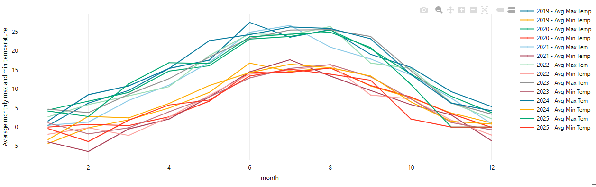
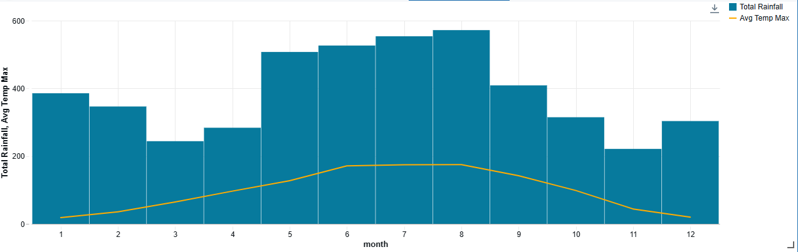
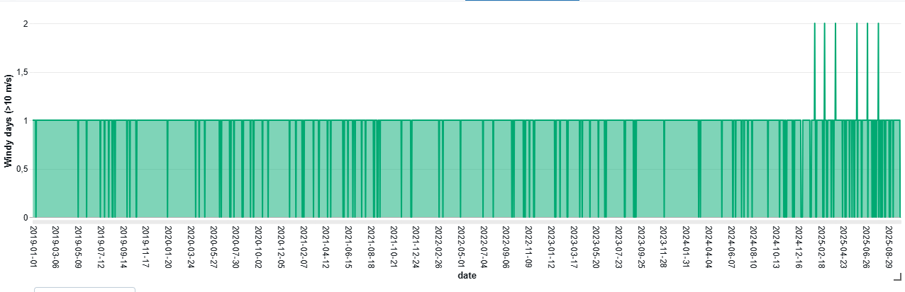

## Real life project which extract historic weather data from Open Meteo API.
1) Extract weather data on daily basis as well.
2) Load data json format to Azure data lake.
3) Clean and transform data into Delta files and SQL Managed Tables in Databricks.
4) Processed data to GOld (Presentation) layer for practical weather trends reports for Data Analysts.

